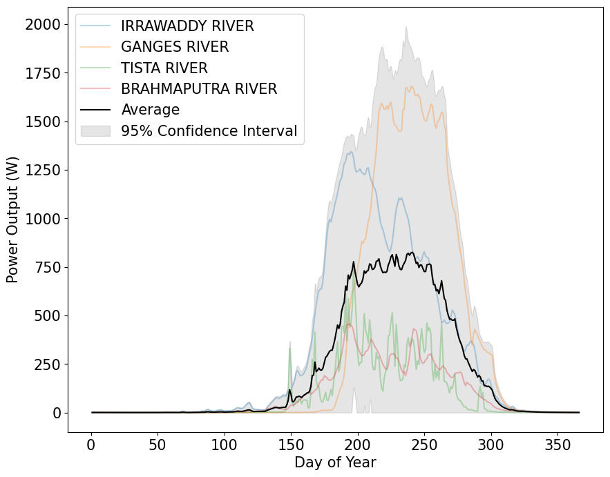
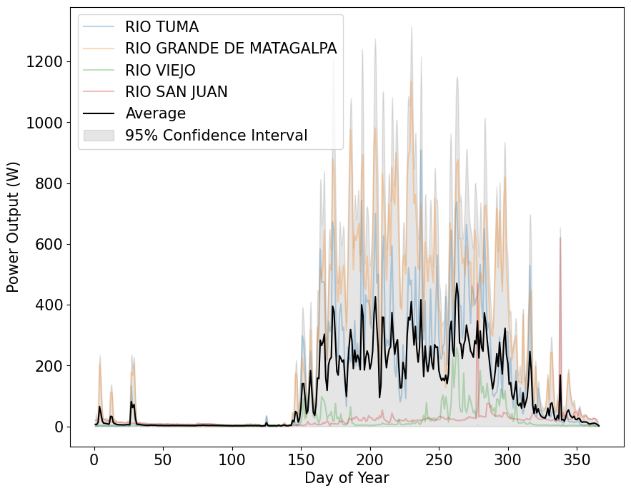
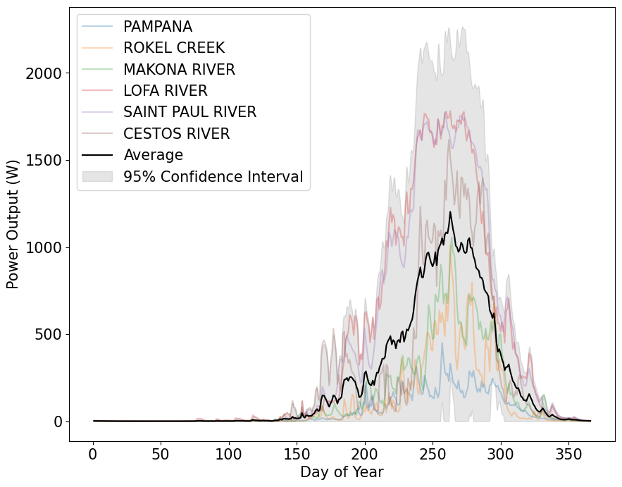
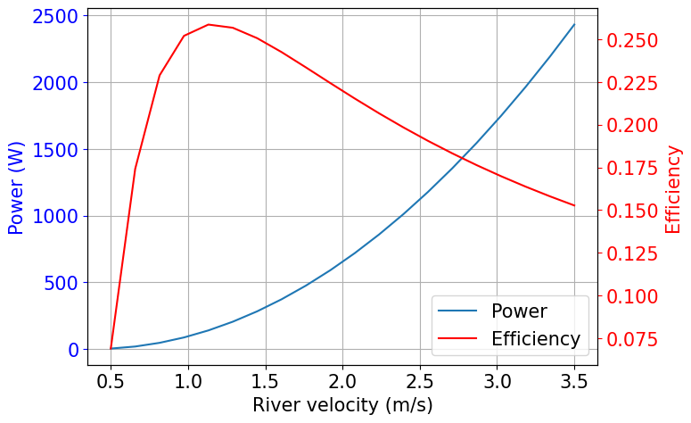
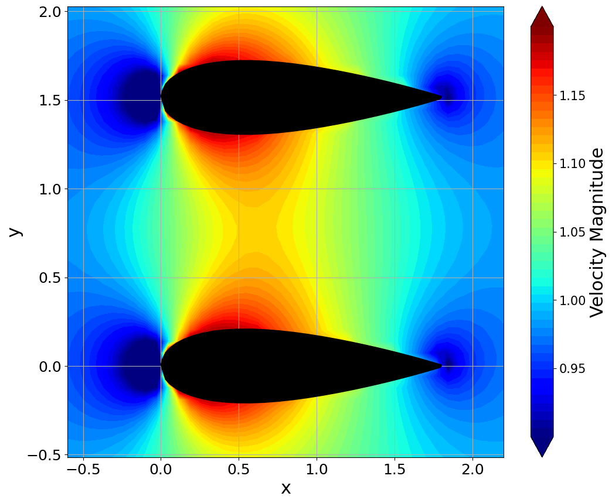
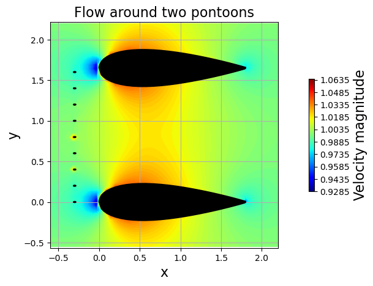

# Capstone Design Project
## Pico Hydro Design and Modelling

This repository contains the code and data for the capstone design project of the 2023-24 academic year. The project is to design a pico hydro turbine for a river in a developing country. 

## Site Selection

The sites were selected based on both high hydro potential and the need for electrification. Potential case studies are found in East Asia, South America, and West Africa. The sites are:

## Mechanical Design, Power Generation

The mechanical design is based on the PicoStream turbine. This repository contains calculations on material requirements in the main.ipynb file. 

## Pontoon Modelling

The effect of pontoons is modelled using a simple potential flow model initially created by Barba, Lorena A., and Mesnard, Olivier (2019). Aero Python: classical aerodynamics of potential flow using Python. 
Journal of Open Source Education, 2(15), 45, https://doi.org/10.21105/jose.00045
This model has been chosen as it allows freedom to model complex geometries and is open source.

